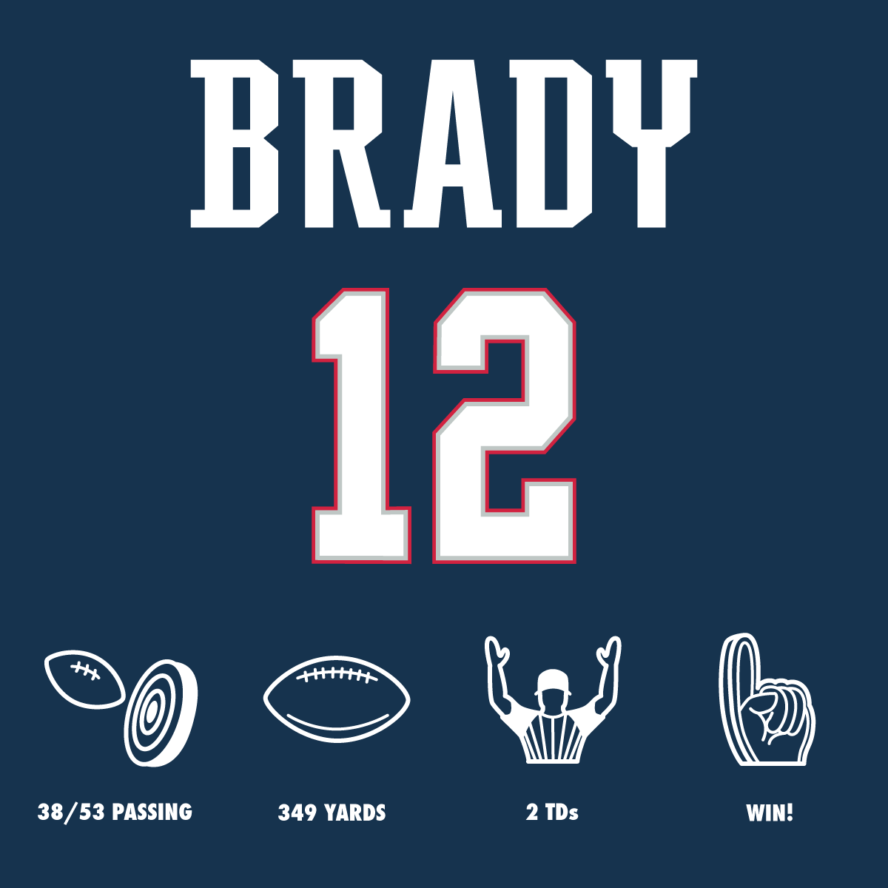

# Have A Day Generator

A web-based tool that lets you create "Have A Day"-style graphics for any athlete in any sport—automatically. Just enter the player's name, number, and a few stats, and get a ready-to-share image in seconds.

## Project Goal

To eliminate the need for manual graphic design by generating sports stat graphics programmatically, saving time and enabling scalability across multiple sports and players.

## Features (Planned)

- Input Player Name & Jersey Number
- Choose Sport-Specific Template
- Add 3–4 Key Stats
- Auto-generate Graphic with Proper Layout & Icons
- Download/Share Generated Image

## Tech Stack (Proposed)

| Component | Technology |
|----------|------------|
| UI | React w/ Tailwind or Next.js |
| Backend | Node.js (Express) or Python (Flask/FastAPI) |
| Image Generation | Canvas API (Node), SVG.js, Sharp, or PIL |
| Design Assets | Figma or Adobe Illustrator |
| Hosting (Future) | Firebase / Supabase |
| Authentication (Optional) | Firebase Auth / Auth0 |

## Folder Structure (Planned)

have-a-day-generator/
├── client/ # React frontend
├── server/ # Backend rendering API
├── assets/ # Icons, templates, fonts
├── examples/ # Sample outputs
└── README.md

## Design Inspiration

Inspired by NFL's "Have A Day" graphics. Here's a reference:

## Future Roadmap

- [ ] Create static templates in Figma/Illustrator
- [ ] Build MVP frontend for input form
- [ ] Implement backend rendering with SVG/Canvas
- [ ] Add support for sport-specific templates

---
Created by [Vincent Pennachio](https://github.com/vpennach).
